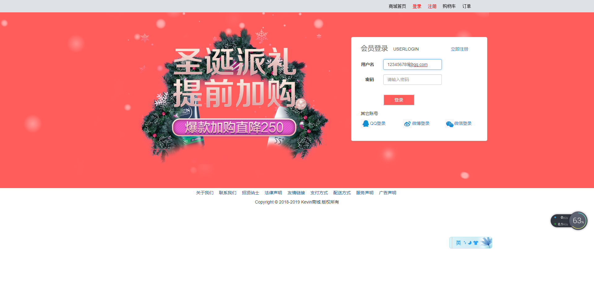

# SSM学习
javaweb大作业转SSM

## 在线演示

https://localhost:8080

- 账号：12345678@qq.com
- 密码：1234546

## 技术

| 描述         | 框架                | 版本          |
| ------------ | ------------------- | ------------- |
| 核心框架      | Spring              | 4.3.18.RELEASE |
| 视图控制框架   | Spring MVC         | 4.3.18.RELEASE |
| 持久层框架     | mybatis          | 3.4.6       |
| 连接池       | Druid               | 1.1.12        |

**环境准备：**

1. JDK1.8+
2. MySQL5.X+
3. Maven3.X+

## 展示图

